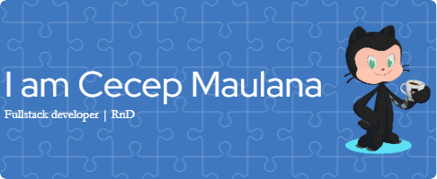

    

<h3 align="center">slow bro! we are the heroes in our own stories!</h3>

    

###
---
###

### 🧑🏻‍💻 Who'm I?

Berbekal pengalaman komprehensif dalam pengembangan web , saya seorang insinyur perangkat lunak profesional yang berdedikasi menciptakan inovasi. Fokus utama saya adalah pengembangan aplikasi tangguh dengan adherence ketat pada kode bersih dan standar industri terkini.

**cecep maulana.*

###

### ⚔️ Languages

    
    
    
    
    
    
    
    

### 📚 Frameworks and Libraries

    
    
    
    
    

### 🧰 Tools

    
    
    
    
    
    
    
    
    
    
    
    
    
    
    
    
    
    
    
    

###

    

        
    

    

        
        
    

    <!-- 

        
    
 -->
    

        
    

